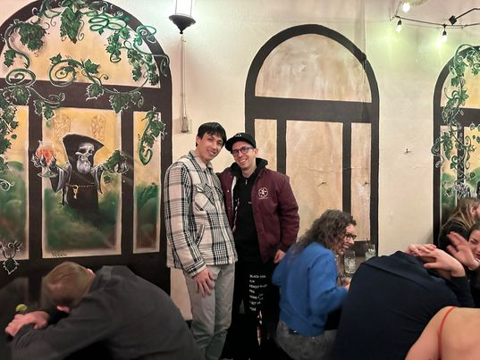

- [My Github!](https://github.com/JulianKnodt)
- Email: julianknodtgmail.com

Me and Cory Wong! I was standing weirdly because I was nervous taking a picture with him.

<button id = "where_am_i">Where Am I</button>

---

Hey, I'm a programmer who is interested in a myriad number of things!
I'm broadly interested in graphics (physically based rendering), compilers (Rust!),
operating systems, and how people interact with social networks. I also dabble in
machine learning, when it's small enough to run on my 2010 GPU.

Outside of programming, I _try to_ spend my time attempting to cook and bake,
taking stupidly long walks around my neighborhood, and fencing. I'm still exploring
many new activities 🙇, so if there's anything neat to do feel free to reach out.

If you're looking to collaborate on something, want to get coffee/tea, or are just generally
interested in chatting, email me! I'm all over the place, so see above for where I am currently.

If you have any comments or questions on my writing, go to the [github repo][github repo] for
this page, and file an issue, or make a pull request! I'll get to 'em eventually.

<table style="table-layout:fixed;display:inline-table;">
<!-- Row 1 -->
<tr>
<th>

Writings:

</th>
<th>

Projects:

</th>
</tr>
<!-- Row 2 -->

<tr>
<td>

- [Random Sparsity Pattern Ideas](sparsity_patterns.md)
  - Exploration of idea for sparsity in matrices, random thoughts.

- [Unrealistic Algorithmic Analysis](unrealistic_algorithmic_analysis.md)
  - I'm a bit disappointed in how big `O` analysis is often not useful, because it ends up
    ignoring the architecture of computers and how data caches work. This is a rant about how
    there may be more feasible ways to measure complexity, by keeping costs of different
    operations such as arithmetic/memory accesses separate.

- [Useless blog posts](useless_blogs.md)
  - A meta blog post about blog posts which have no meaning, i.e. the 10th blog to explain
    React.

- [A way to reduce Registry Bloat](writings/registry_market.md)
- [An intro to Raytracing](writings/raytracing.md)

<!-- - [Teaching with Writing?](writings/writing.md) -->
- [Graphics Problems](writings/graphics_problems.md)
- [Why I learned Rust and Why I work on it](writings/rust01.md)
- [Bezier Spline NeRFs](writings/bezier_spline_nerfs.md)
- [Classes](writings/classes.md)

- [2024 Weekly Writings](writings/2024/index.md)

</td>
<td>

- [Ink Renderer](http://ink-renderer.herokuapp.com/)
  - [Github](https://github.com/JulianKnodt/gfx-final-project)
  - Final Project for [graphics](https://www.cs.princeton.edu/courses/archive/spring20/cos426/)
- [Square Heap](https://github.com/JulianKnodt/sqr_heap)
  - An experiment with modifying the number of children for a heap. See readme for more info
- [Mireba](https://github.com/JulianKnodt/mireba)
  - A photorealistic raytracer based on [Mitsuba](https://www.mitsuba-renderer.org/). WIP.
- [quick maths](https://github.com/JulianKnodt/quick_maths)
  - A simple math library for use with mireba. Hopefully I can continue to upgrade to be more
    full-fledged for general purpose use but right now it's designed for graphics.
- [Mat-FST](https://github.com/JulianKnodt/mat-fst)
  - An experiment for using [Finite State Transducers](https://github.com/BurntSushi/fst) as
    sparse matrices. Check out the readme for more info.
- [Small-SAT](https://github.com/JulianKnodt/small_sat)
  - A concurrent SAT solver based on MiniSAT. Exploring the idea of having multiple threads, but
    would've been a lot better if I had known Rust better at the time. Still learned a lot from
    it though.
- [artPanel](https://github.com/JulianKnodt/artPanel)
  - A fun CLI util to render images in terminal with color. If you're in terminal all the time
    and find it bland you can run this in the background to lighten things up.

</td>
</tr>

<!-- End table -->
</table>

## Games

I'm trying to get into making my own little games using
[Pico-8](https://www.lexaloffle.com/pico-8.php), which is a fantastic little game maker and way
to run games. I've had moderate success, but will share what I make here!

- [Starmine](https://julianknodt.github.io/starmine.html)
  - A space shooter resource gathering game

- [Sozu](https://julianknodt.github.io/sozu.html)
  - A Sozu (deer-scare) simulator

- [Slime Ball](https://julianknodt.github.io/shoot.html)
  - Kick a ball around as a slime

- [Infinite Runner](https://julianknodt.github.io/runner.html)
  - The first Pico-8 game I made (2019)
  - Revived thanks to help from the [Pico-8 forum!](https://www.lexaloffle.com/bbs/?pid=132231#p)
  - Jump around, jump up, jump up, and get down

## Work History

For those interested in hiring me,
I've worked at a variety of places, on system software,
and am mostly interested in backend/low-level software or research!

Where I've worked:

##### Internships:

Winter thru Summer '17: [Brigade](https://en.wikipedia.org/wiki/Brigade_Media)
  - Android Development (Kotlin) & GraphQL (Node) + Ruby on Rails

Summer '18: Paypal
  - GraphQL (Node)

Summer '19: Google
  - Testing liveliness of servers (Golang)

Summer '21: [Tailscale](https://tailscale.com/)
  - Add new port mapping protocols, Routing Server metrics (Golang)
  - See commits [here](https://github.com/tailscale/tailscale/pulls?q=is%3Apr+author%3Ajulianknodt)

##### Research:

While the line between research and normal programming can be blurry, there are some things
which are clearly research. While these are definitely "research", usually I find just messing
around with code can be close to research in its own way.

Summer '20: [Princeton Computational Imaging Lab](https://light.princeton.edu/)
  - Mitsuba implement time of flight gating (C++)

[Arxiv!](https://arxiv.org/search/?query=julian+knodt&searchtype=all&source=header)

2023: ![new][new] Joint UV Optimization and Texture Baking
  - Julian Knodt, Zherong Pan, Kui Wu, Xifeng Gao
  - [ACM](https://dl.acm.org/doi/10.1145/3617683)
  - [Blog Post](papers/joint_uv_optimization_and_texture_baking)

<!-- TODO list papers individually -->

## Other Stuff

I also have been keeping a playlist for 7 years! This is the accumulation of some of the music
I've been listening to since the end of high-school, and it at times reflects the emotions I
felt while living my life. In that way, I consider it a summary of how I've felt over the past 7
years, so I hope that while listening to it, you can experience some of what I've felt.

- [Music!](playlist.md)
- [Non-YT Music](other_music.md)
- [Music Timeline](yt_timeline.html)
- [Half Marathon Prep](half_marathon_prep.md)

<iframe src="yt_timeline.html" width="800" height="512">
</iframe>

[github repo]: https://github.com/JulianKnodt/julianknodt.github.io
[new]: https://web.archive.org/web/20090829095811/http://geocities.com/uspa.geo/new6.gif

### Links!

- [The OG](https://ogthoughts.github.io/)
- [Jane, NLP 🪿](https://janepan9917.github.io/)
- [Chuck](http://charliemsmith.com/) & [His Cheesy Goodness](http://charliemsmith.com/curdle/)
- [The Memelord and Visionary](https://ilyac.info/)
- [Xander, Programmer & 🇯🇵](https://xanderk.ooo/)
- [Byron, Math 🧙](https://math.mit.edu/~byronc/index.html)
- [Lilly, sufferer of oncall 🪟🫠](https://lillymeng.com/)

TMP: https://docs.google.com/presentation/d/1uffYrB2Pb3OzCvE_yFEIarLWCHGBqp084ge5b5yoSK4/edit?usp=sharing
